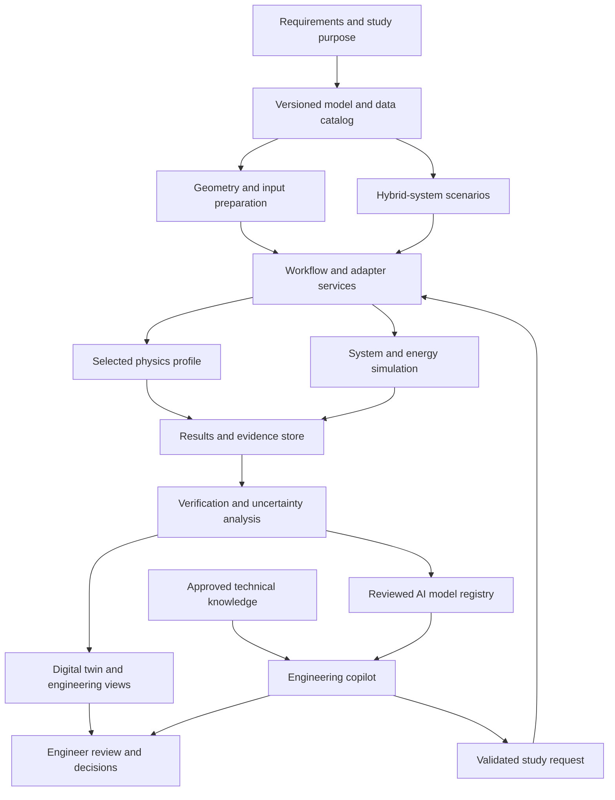

# JFXAI4NHES — Open Architecture for AI-Assisted Nuclear Hybrid Energy Simulation

**Consolidated English integration proposal · Reviewed: 2026-09-15**

**Project:** [robotics-intelligent-systems/jfxai4nhes][project]

JFXAI4NHES is proposed as a modular research and engineering platform connecting nuclear simulation, plant-system models, hybrid energy analysis, and artificial intelligence. It brings the existing software compendium into a common architecture for reproducible studies, model comparison, uncertainty analysis, digital twins, and engineering decision support.

The expanded concept covers the relationship between a nuclear energy source, power conversion, thermal storage, renewable generation, electrical storage, and industrial energy demand. It preserves the original **MBSE → CAD → CAM → CAS** engineering structure and adds traceable data, simulation, and AI services.

**Status:** this is a development proposal. At the inspected revision, JFXAI4NHES contains a README rather than an implemented integration platform. The services, adapters, interfaces, and deployment profiles below are proposed deliverables. Component descriptions are grounded in the referenced upstream documentation; interoperability remains subject to implementation and verification.

**Suggested short project description**

> Open integration architecture for nuclear hybrid energy research, combining multiphysics simulation, digital twins, uncertainty quantification, local AI, and reproducible engineering workflows.

## Table of Contents

- [1. Purpose and engineering scope](#purpose)
- [2. Architecture principles and source findings](#principles)
- [3. Consolidated software compendium](#compendium)
- [4. Proposed hybrid-energy and AI extensions](#extensions)
- [5. High-level integration architecture](#architecture)
- [6. Subsystems and responsibilities](#subsystems)
- [7. Physics, geometry, and workflow integration](#integration-paths)
- [8. AI and engineering-copilot architecture](#ai-architecture)
- [9. Digital twins and transparent visualization](#digital-twins)
- [10. Middleware, interfaces, and data contracts](#contracts)
- [11. Verification, validation, and uncertainty](#validation)
- [12. Execution boundaries and information security](#execution-boundaries)
- [13. Deployment profiles](#deployment)
- [14. Engineering requirements](#requirements)
- [15. MVP and implementation roadmap](#roadmap)
- [16. Proposed repository organization](#repository-structure)
- [17. Licensing, provenance, and maintenance](#licensing)
- [18. References and review baseline](#references)

---

<a id="purpose"></a>

## 1. Purpose and Engineering Scope

The [existing description][baseline] presents a nuclear power-plant simulation compendium, while the repository metadata identifies **Nuclear Hybrid Energy Systems** as the broader project domain. This consolidation connects those two levels.

The intended users are systems engineers, simulation specialists, researchers, educators, and analysts evaluating integrated energy scenarios. The platform should support questions such as:

- Which models and datasets support a particular engineering conclusion?
- How do different simulation methods compare for the same declared purpose?
- How does thermal or electrical storage change the performance of an integrated energy scenario?
- Where can a reduced-order model accelerate a study without exceeding its validated domain?
- Which uncertainty sources dominate the reported result?
- Can another engineer reproduce the case, its assumptions, and its acceptance decision?

The project is an engineering research and training environment. Real plant operation, protective systems, and equipment authorization remain outside the AI execution interface.

| Engineering stage | Consolidated role | Traceable artifacts |
|---|---|---|
| MBSE | Use Arcadia/Capella-oriented models to define functions, interfaces, assumptions, and verification obligations | Requirements, functional architecture, interface definitions |
| CAD | Maintain geometry and its relationship to simulation regions and asset identities | Geometry revisions, material identifiers, simplification records |
| CAM | Retain manufacturing and assembly information where relevant to the engineering lifecycle | Process documentation and configuration records |
| CAS | Coordinate system, thermal-fluid, transport, and statistical studies | Cases, solver configurations, results, validation evidence |
| Digital twin | Relate a model revision to scenario or observation data | State snapshots, provenance, calibration status |
| AI assistance | Retrieve evidence, prepare reviewed studies, and explain recorded results | Cited answers, approved tool requests, model evaluations |

<a id="principles"></a>

## 2. Architecture Principles and Source Findings

**Compose the platform through explicit contracts.** A CAD translator, a transport solver, an uncertainty framework, and a teaching simulator solve different problems. They should not be presented as interchangeable engines.

**Separate three kinds of intelligence:** numerical physics, statistical or learned approximations, and language-based assistance. Numerical feasibility and scientific results must come from the relevant models and evidence, with their limitations visible.

**Select a small working profile.** The compendium supplies alternatives and specialized extensions. A useful deployment does not require every package.

**Define openness across the complete execution path.** Source-code availability alone does not establish that all required preprocessors, compilers, physics plugins, datasets, or model artifacts are freely redistributable.

The source review identified several implementation-relevant distinctions:

| Finding | Architectural consequence |
|---|---|
| [DASSH Python][dassh] explicitly describes itself as obsolete and no longer maintained | Retain it as a legacy comparison candidate; do not silently substitute the separately distributed DASSH-F |
| [HYBRID][hybrid] and [TRANSFORM][transform] document Dymola requirements | Treat their documented runtime path separately from a proposed OpenModelica portability effort |
| [ARMI][armi] explains that it does not include a complete set of physics kernels | Select and qualify the required plugins independently |
| [McCAD][mccad] documents BREP-to-CSG work and MCNP-oriented conversion | Do not assume native OpenMC output without a verified conversion path |
| [DAGMC][dagmc] documents a geometry-preparation workflow involving Cubit | Qualify an open preprocessing alternative or keep that workflow as an optional externally provisioned profile |
| [OpenReactor in the SDK2035 portfolio][openreactor] lists major functions as planned | Keep it in the exploratory category until code and benchmarks establish the required capability |
| [ClaRa's package declaration][clara-package] names additional libraries, including TILMedia and SMArtInt | Check model, media-library, and runtime compatibility together |
| The original README names DSNP without a repository or version | Preserve it as a historical reference requiring identification before adoption |

These findings guide component selection; they are not a claim that the entire upstream ecosystem has been audited.

<a id="compendium"></a>

## 3. Consolidated Software Compendium

All named entries from the original description are retained below. The repeated Research Reactor Simulator entry is consolidated into one row. “Role” describes the proposed placement in JFXAI4NHES, not an already implemented connector.

### 3.1 Engineering references and geometry

| Component | Verified or stated scope | Proposed role and qualification |
|---|---|---|
| [OPEN100][open100] | Public academic framework and engineering reference for nuclear plant development | Requirements and conceptual design reference; not a solver or a project-specific approved plant design |
| [McCAD][mccad] | CAD solid-model conversion toward Monte Carlo input representations | Geometry translation adapter with explicit target-format verification |
| [DAGMC][dagmc] | CAD-based geometry support for Monte Carlo transport | Alternative geometry route; validate preparation tooling, material mapping, and geometry integrity |
| [msre][msre] | Historical MSRE CAD and OpenMC benchmark work | Versioned research and benchmark reference; document model assumptions and geometry provenance |

The [OPEN100 project][open100] describes its role as an academic development framework. JFXAI4NHES should use it as background context, with project-specific engineering requirements maintained separately.

### 3.2 Nuclear data, statistical analysis, and verification

| Component | Scope | Proposed role |
|---|---|---|
| [NucML][nucml] | Supervised machine-learning workflow for nuclear-data evaluation | Research data preparation, feature engineering, and model comparison |
| [JADE][jade] | Verification and validation workflows for nuclear-data libraries and transport codes | Benchmark execution, comparisons, and evidence generation |
| [TALYS][talys] | Nuclear-reaction modeling software | Specialized research-code adapter with versioned inputs and outputs |
| [FUDGE][fudge] | Nuclear-data management, processing, and format conversion around GNDS | Data ingestion, transformation, consistency checks, and provenance |
| [PyNE][pyne] | Nuclear-science and engineering utilities | Shared data utilities behind an isolated dependency environment |

NucML predictions should be labeled as research outputs. They must not silently replace the reviewed nuclear-data library used by a scientific benchmark. The original promotional claim that NucML is the “first and only” pipeline is not used as a selection criterion.

### 3.3 Multiphysics and thermal-fluid simulation

| Component | Scope | Proposed integration position |
|---|---|---|
| [MOOSE][moose] | Finite-element multiphysics framework | Foundation for compatible MOOSE applications |
| [Cardinal][cardinal] | Integrates OpenMC and NekRS capabilities within MOOSE | Candidate high-fidelity multiphysics profile |
| [AURORA][aurora] | Connects OpenMC transport with MOOSE finite-element calculations, with a fusion-oriented scope | Alternative research profile for supported heat and mechanics coupling |
| [ENRICO][enrico] | Coordinates transport and thermal-fluid solvers | Alternative coupling driver; select an explicitly qualified solver combination |
| [GeN-Foam][genfoam] | Multiphysics reactor-analysis solver with coupled thermal-fluid and other models | Separate OpenFOAM-based research profile |
| [TrioCFD][triocfd-docs] | CFD code associated with the TRUST platform | Thermal-fluid adapter candidate; resolve and pin an obtainable source revision |
| [DASSH][dassh] | Steady-state thermal-hydraulic assessment for ducted assemblies | Legacy comparison profile with its maintenance limitation recorded |
| [Moltres][moltres] | MOOSE application for molten-salt and other advanced-reactor simulation | Specialized research profile rather than a general plant simulator |

The [GeN-Foam documentation][genfoam] distinguishes multiple physics formulations and coupling options. JFXAI4NHES should record the chosen formulation and its applicability rather than label every run simply “multiphysics.”

### 3.4 System models and training environments

| Component | Scope | Proposed role and limitation |
|---|---|---|
| [Nuclear Plant RL Gym / nuclear-sim][nuclear-sim] | Current documentation emphasizes scenario running, secondary systems, maintenance, and training-data generation | Scenario and synthetic-data candidate; verify the actual API and any RL wrapper before integration |
| [Research Reactor Simulator][research-simulator] | Graphical teaching and training simulator | Isolated educational workstation or recorded-scenario adapter |
| [DDNRS-ERSN][ddnrs] | Reactor-analysis and learning tool based on DRAGON-5 and DONJON-5 | Educational/research profile with those dependencies qualified separately |
| [ModelicaDFR][modelicadfr] | Proof-of-principle Modelica models for molten-salt systems | Historical modeling reference and portability candidate |
| [ClaRa][clara] | Modelica library for Clausius-Rankine power-cycle simulation | Balance-of-plant model candidate with runtime and media dependencies checked |
| [OpenReactor][openreactor] | Educational/research simulation proposal with planned features | Exploratory development reference |
| DSNP | Legacy Dynamic Simulator for Nuclear Power-Plants entry in the source compendium | Historical reference; exact distribution, version, and license unresolved |

A teaching simulator, a synthetic-data generator, and a qualified engineering model serve different purposes. Their outputs should retain those classifications.

### 3.5 Workflow automation and specialized references

| Component | Scope | Proposed role |
|---|---|---|
| [WATTS][watts] | Python workflow and template toolkit for one or multiple simulation codes | Preferred initial execution-wrapper candidate |
| [ARMI][armi] | Analysis automation and plugin framework | Alternative integration hub for a selected reactor-analysis workflow |
| [ROLLO][rollo] | Evolutionary-algorithm driver that can couple to nuclear software | Offline research optimization reference within explicitly approved study bounds |
| [SaltProc][saltproc] | Liquid-fuel reactor processing simulation | Specialized research reference; separate from the hybrid-energy MVP |
| [OpenReactor IEC][iec] | Experimental IEC instrumentation, control, and logging project | Architectural reference for isolated research telemetry; hardware actuation is outside the JFXAI4NHES AI interface |

**Identity resolution:** the comprehensive simulation entry corresponds to [sdk2035/OpenReactor][openreactor], whose parent is [yasinldev/OpenReactor][openreactor-upstream]. It is distinct from the IEC project [natesales/openreactor][iec], also represented by the [SDK2035 IEC fork][iec-fork].

<a id="extensions"></a>

## 4. Proposed Hybrid-Energy and AI Extensions

The following additions address responsibilities that the original list does not fully cover. They are proposed development dependencies, not existing JFXAI4NHES integrations.

| Addition | Evidence-based capability | Proposed use |
|---|---|---|
| [OpenMC][openmc] | Monte Carlo particle-transport code, also referenced by several existing compendium tools | Explicit transport-engine dependency for selected research profiles |
| [RAVEN][raven] | Sampling, uncertainty analysis, reduced-order modeling, and statistical analysis | Experiment design and evaluation framework |
| [HERON][heron] | RAVEN plugin for resource-allocation and integrated-energy studies | Hybrid-system scenario and resource-allocation analysis |
| [HYBRID][hybrid] | Modular Modelica transient models for integrated energy systems | Reference model collection; documented Dymola profile retained separately |
| [TRANSFORM][transform] | Modelica thermal-hydraulic and multiphysics library | Optional model-development resource with documented runtime qualification |
| [OpenModelica / OMSimulator][openmodelica] | Modeling environment with FMI/SSP-based co-simulation capabilities | Candidate open runtime for a specifically tested model subset |
| [LangGraph][langgraph] | Stateful workflow and agent orchestration | Optional engineering-copilot workflow layer |
| [Qdrant][qdrant] | Vector search with metadata payloads | Optional retrieval index for approved technical documents |
| [MLflow][mlflow] | Model and AI evaluation, tracking, and lifecycle tooling | Candidate experiment and model registry |
| [llama.cpp][llamacpp] | Local language-model inference runtime | Optional local inference backend for a separately selected model |

The [HYBRID documentation][hybrid] already places HYBRID, HERON, and RAVEN in a related integrated-energy workflow. JFXAI4NHES should adapt that relationship while qualifying the exact runtime path. It should not assume that a Dymola-based model collection runs unchanged in OpenModelica.

For the initial open profile, develop or select a small validated system model using the chosen open runtime's supported components. Keep commercial-runtime models optional until a compatible open implementation has been demonstrated.

<a id="architecture"></a>

## 5. High-Level Integration Architecture

The architecture separates model preparation, execution, scientific evaluation, and AI assistance.



This is the **software integration topology**. It does not represent a direct control path to a nuclear facility.

For a hybrid-energy study, the system model connects the declared nuclear-source boundary with power conversion, storage, renewables, and demand. Detailed reactor physics can remain an offline reference profile; it need not execute inside every short system-level timestep.

<a id="subsystems"></a>

## 6. Subsystems and Responsibilities

| ID | Subsystem | Responsibility | Primary outputs |
|---|---|---|---|
| `SYS-01` | Requirements and architecture | Define study purpose, interfaces, constraints, and acceptance criteria | Versioned requirements and verification cases |
| `SYS-02` | Model and data catalog | Identify source revisions, datasets, licenses, and applicability | Model cards and dataset manifests |
| `SYS-03` | Geometry preparation | Validate geometry, regions, units, and representation conversions | Solver-compatible geometry artifacts |
| `SYS-04` | Scientific execution | Run a selected solver or coupling profile in an isolated environment | Results, logs, convergence information |
| `SYS-05` | Hybrid-energy modeling | Represent power conversion, storage, demand, and declared energy-source boundaries | Time series and resource balances |
| `SYS-06` | Sampling and evaluation | Execute experiments and assess uncertainty, sensitivity, and validation | Evaluation reports and acceptance status |
| `SYS-07` | AI research and serving | Train and serve bounded statistical models and optional language models | Versioned model artifacts and applicability records |
| `SYS-08` | Digital twin | Associate state with model, geometry, time, and evidence | Observed, simulated, and predicted views |
| `SYS-09` | Engineering workspace | Inspect cases, compare outcomes, and record decisions | Reviewed study revisions and reports |
| `SYS-10` | Platform services | Manage identities, queues, storage, monitoring, and reproducible deployment | Auditable execution and recovery records |

Each subsystem should have an owner and an explicit contract. WATTS, ARMI, and RAVEN have overlapping orchestration capabilities; the chosen profile must name the top-level scheduler and define what subordinate tools own.

<a id="integration-paths"></a>

## 7. Physics, Geometry, and Workflow Integration

### 7.1 Geometry routes

The platform should support alternative geometry paths without implying automatic equivalence:

| Route | Proposed path | Verification obligation |
|---|---|---|
| Native transport geometry | Reviewed native geometry definition → selected transport solver | Region identities, materials, units, and geometry checks |
| CAD to CSG | CAD revision → McCAD or another qualified translator → verified target representation | Supported output format, overlaps, voids, and mapping fidelity |
| CAD-based transport | CAD revision → qualified preparation workflow → DAGMC-enabled solver | Watertightness, surface topology, material labels, and preprocessing dependencies |

A visual match is insufficient evidence of numerical equivalence. Keep the original geometry, converted representation, checks, and simplification assumptions in the run record.

The first reproducible transport profile can use native OpenMC geometry. A complete CAD conversion chain can be added after its tooling and validation are established.

### 7.2 Nuclear-data path

Treat evaluated data, processed data, and learned estimates as different artifact classes.

A proposed workflow uses data utilities such as FUDGE and PyNE, followed by code-specific processing and benchmark comparison. NucML may support a separate research evaluation branch; JADE may support relevant benchmark workflows. The exact processing and solver interfaces require dedicated adapters.

Record the dataset origin, permitted use, processing configuration, output hash, and compatible solver version. File-format conversion alone does not prove scientific consistency.

### 7.3 Multiphysics profiles

Choose one primary coupling arrangement for a given study.

| Profile | Candidate composition | Selection rationale |
|---|---|---|
| MOOSE-centered high fidelity | Cardinal with its supported OpenMC/NekRS integration | Existing coupling framework for a defined high-fidelity study |
| Fusion-oriented thermal/mechanics study | AURORA with supported OpenMC/MOOSE functionality | Match its documented scope |
| Alternative coupling driver | ENRICO with selected supported solvers | Explicit driver-level solver selection |
| OpenFOAM-centered study | GeN-Foam | Separate discretization and coupling ecosystem |
| Specialized application | Moltres, TrioCFD, or another qualified model | Domain-specific requirements and validation evidence |

Do not run Cardinal, AURORA, ENRICO, and GeN-Foam as a single mandatory chain. Comparison between them should use a common problem definition while documenting differences in equations, data, boundaries, and discretization.

### 7.4 Hybrid-energy path

For an initial system study, represent the nuclear source through an approved model or declared boundary-condition artifact. Connect the balance of plant, thermal storage, electrical storage, renewable supply, and energy demand through explicit interfaces.

HERON and RAVEN can inform resource-allocation and uncertainty workflows. A dynamic system model checks whether the scenario respects modeled constraints and balances. Any economic result is a scenario output tied to its assumptions, not an investment recommendation or a guaranteed return.

### 7.5 Training and educational path

Place classroom simulators and synthetic-data generators in separate profiles. Preserve their educational or exploratory status in every exported dataset.

“Nuclear Plant RL Gym” is a repository description, not proof of a particular current Gymnasium contract. Inspect and implement reset, step, observation, action, and termination mappings before selecting a training framework. Record how synthetic scenarios differ from empirical data.

<a id="ai-architecture"></a>

## 8. AI and Engineering-Copilot Architecture

AI should improve access to evidence, experiment throughput, and interpretation while preserving the distinction between generated text and computed scientific results.

| Capability | Proposed application | Evaluation and boundary |
|---|---|---|
| Retrieval-augmented assistance | Find model assumptions, manuals, requirements, and previous reports | Cite document revision and supporting passage |
| Study preparation | Draft scenario manifests and bounded tool requests | Schema checks and engineer review before costly execution |
| Surrogate modeling | Approximate a qualified model within a declared domain | Held-out error, uncertainty, and out-of-domain detection |
| Sensitivity and experiment support | Suggest informative simulation cases | Resource budget, reproducibility, and approved study scope |
| Anomaly analysis | Identify discrepancies in synthetic or authorized observation data | Distinguish sensor, model, and scenario mismatch |
| Result interpretation | Explain recorded differences and uncertainty | Numeric statements trace to result artifacts |
| Training-policy research | Compare policies in a validated simulator | Simulator-only actions and deterministic reference baselines |
| Report drafting | Prepare engineering summaries and evidence tables | Human review of findings, limits, and cited results |

### 8.1 Copilot tool boundary

Expose narrow operations such as:

- Search approved documentation.
- Retrieve a model card or dataset manifest.
- Validate a study request.
- Estimate an execution budget.
- Submit an approved simulation job.
- Inspect result summaries and validation records.
- Draft a comparison report.

The copilot should not receive unrestricted shell access, arbitrary outbound tool targets, or equipment-write capabilities. Technical documents and retrieved content are evidence inputs, not authority to change execution policy.

### 8.2 Local inference

An optional local deployment may use llama.cpp with a compatible model selected for the available hardware and intended tasks. Record model identity, model license, context limits, retrieval configuration, and evaluation results.

The inference runtime's license does not determine the model weights' license. Model size, response latency, and retrieval quality should be measured on the actual deployment rather than inferred from a generic hardware label.

### 8.3 Learned scientific models

Every released surrogate should declare:

| Field | Required meaning |
|---|---|
| Intended use | The specific study task it supports |
| Training lineage | Input data, simulation revisions, and transformations |
| Validity domain | Covered variables, scenario classes, and applicable conditions |
| Error evidence | Held-out comparisons against the declared reference |
| Uncertainty method | How intervals or uncertainty estimates are produced and evaluated |
| Abstention rule | Conditions that require a reference solver or engineer review |
| Release record | Model revision, acceptance decision, and rollback target |

Reduced runtime is useful only when the approximation remains fit for the study. A language model's confidence statement is not a scientific uncertainty estimate.

<a id="digital-twins"></a>

## 9. Digital Twins and Transparent Visualization

A digital twin should link geometry, model configuration, state, and evidence. A rendered model with transparent surfaces is a visualization layer, not evidence that a synchronized or validated twin has been implemented.

Maintain separate state classes:

| State class | Meaning | Display requirement |
|---|---|---|
| Observed | Authorized measurements from an identified source | Timestamp, unit, provenance, quality, and age |
| Simulated | Output of a declared numerical case | Model revision, run ID, and convergence status |
| Predicted | Output of a learned model | Model revision, validity domain, and uncertainty evidence |
| Proposed | A candidate study configuration or reviewed recommendation | Proposal revision and review state |

The visualization may show translucent equipment envelopes, pipes, structures, heat-transfer regions, and energy-flow overlays. Each selectable object should resolve to a stable asset or model-region ID.

Use separate rendering and scientific-result representations. A simplified mesh suitable for interactive display must not silently replace the solver mesh. Keep the transfer between them explicit and testable.

For a connected research profile, begin with authorized read-only data ingestion. Claims about synchronization or real-time behavior should be based on measured update rates and the intended model horizon.

<a id="contracts"></a>

## 10. Middleware, Interfaces, and Data Contracts

Use process adapters for existing scientific executables and native APIs where available. REST should serve orchestration and inspection; it should not be inserted into every numerical solver iteration.

| Boundary | Proposed contract | Required checks |
|---|---|---|
| Requirements → model | Versioned identifiers and applicability links | Scope and revision consistency |
| CAD → solver geometry | Supported geometry files plus mapping manifest | Units, regions, topology, and material assignment |
| Dataset → solver | Code-specific processed data plus provenance | Format/version compatibility and integrity |
| Workflow → execution | Job specification with immutable input references | Resource limits, environment identity, and reproducibility |
| System model → co-simulation | Qualified FMI/FMU or another explicit exchange interface | Initialization, time stepping, units, and capability support |
| Solver → results | Structured result index plus native artifacts | Completion status, convergence, and schema |
| Results → AI | Curated numeric features and documented transformations | Data lineage and leakage prevention |
| Twin → workspace | Versioned state snapshots and asset mapping | Freshness, state class, and display correctness |

OpenModelica includes OMSimulator, but this does not mean every compendium package exports FMUs. Non-FMI tools require a dedicated process or native coupling adapter.

### 10.1 Proposed service API

These endpoints describe future JFXAI4NHES services.

| Endpoint | Purpose |
|---|---|
| `POST /api/v1/studies` | Register purpose, model references, and acceptance criteria |
| `POST /api/v1/studies/{study_id}/preflight` | Check schemas, dependencies, resources, and permitted execution |
| `POST /api/v1/runs` | Submit a versioned, authorized job |
| `GET /api/v1/runs/{run_id}` | Retrieve status and result references |
| `POST /api/v1/evaluations` | Request a declared benchmark or comparison |
| `GET /api/v1/models/{model_id}/card` | Inspect applicability and model evidence |
| `GET /api/v1/twins/{twin_id}/snapshots/{snapshot_id}` | Retrieve an identified state view |
| `POST /api/v1/reviews` | Record acceptance, rejection, or required changes |

Mutating requests should support idempotency and expected-revision checks. A transport-level success response must not be interpreted as scientific convergence or engineering acceptance.

### 10.2 Illustrative study manifest

This is a **proposed configuration example**, not an existing runnable upstream file. It contains no plant operating settings.

```yaml
schema_version: jfxai4nhes.study.v1
study_id: hybrid-energy-demo
purpose: balance-of-plant-research
execution_mode: simulation-only

model:
  artifact_id: system-model-demo-r1
  runtime_profile: open-runtime-candidate
  qualification_status: pending
  nuclear_source_boundary: reviewed-boundary-demo-r1

scenario:
  dataset_id: synthetic-energy-demand-demo-r1
  time_basis: simulation
  unit_system: SI
  seed: 42

workflow:
  adapter_profile: watts-process-adapter-proposed
  resource_profile: local-research-demo
  allow_external_actuation: false

evaluation:
  reference_case: deterministic-baseline-demo-r1
  acceptance_profile: energy-balance-demo-r1
  check_convergence: true
  check_data_provenance: true
  uncertainty_status: not-yet-evaluated

ai:
  copilot_mode: evidence-assistance
  surrogate_release: none
  generated_changes_require_review: true

review:
  status: draft
  responsible_role: simulation_engineer
```

The implementation must resolve symbolic artifact IDs into immutable revisions and hashes before execution. A `pending` model cannot be reported as qualified.

### 10.3 Coupling semantics

For every coupled run, record ownership of each state variable, the synchronization method, exchanged units, temporal interpolation, conservation checks, convergence criteria, and failure handling.

Steady-state transport studies, transient system models, and computationally expensive CFD calculations have different execution characteristics. Select sequential studies, co-simulation, or tightly coupled solvers according to the analysis purpose.

<a id="validation"></a>

## 11. Verification, Validation, and Uncertainty

Quality evidence should be produced with the simulation workflow rather than reconstructed after the report is written.

| Evidence level | Question | Representative evidence |
|---|---|---|
| Software verification | Does the implementation perform the intended computation? | Unit cases, regression results, versioned environments |
| Geometry and data verification | Were inputs translated and interpreted correctly? | Mapping checks, data provenance, schema validation |
| Numerical assessment | Is the result sufficiently resolved and converged for this study? | Solver diagnostics and case-appropriate refinement evidence |
| Model validation | Does the model adequately represent the intended phenomenon? | Relevant benchmark or empirical comparisons |
| Uncertainty assessment | What sources of uncertainty affect the conclusion? | Sampling, sensitivity, and uncertainty records |
| AI evaluation | Is the learned or language-based output fit for its declared role? | Held-out tests, citation checks, domain limits |
| Engineering review | Is the evidence sufficient for the stated use? | Acceptance record with limitations and responsible reviewer |

JADE and RAVEN can support parts of this workflow; their use does not automatically qualify the entire platform.

Define acceptance criteria before comparing candidate results. Keep numerical error, parameter uncertainty, stochastic sampling error, and model-form discrepancy distinct where the study requires it.

For hybrid-system cases, verify the declared energy and resource balances, storage-state consistency, event handling, and unmet-demand accounting. For learned models, prevent the same scenario lineage from leaking across training and evaluation sets.

Report runtime reductions only alongside accuracy, domain coverage, and computational environment. This proposal makes no fixed performance or cost-saving promise.

<a id="execution-boundaries"></a>

## 12. Execution Boundaries and Information Security

The platform's default execution authority is **simulation and engineering analysis**.

| Area | Proposed boundary |
|---|---|
| Nuclear and IEC equipment | No AI tool path to physical actuation or protective-system changes |
| Research optimization | Explicit study scope, reviewed variables, and finite execution budget |
| Model promotion | Evidence and reviewer decision required before a model becomes a study default |
| Operational observations | Authorized read-only ingestion, with origin and data quality recorded |
| Sensitive information | Access controls and retention matched to the dataset and project |
| Retrieved documentation | Used as reference material; embedded instructions cannot authorize tool actions |
| Failure handling | Preserve failed-run evidence and return clear status; do not fabricate replacement results |

Keep research simulation workers isolated from operational networks. If a future project requires operational integration, it should be treated as a separately engineered system with its own responsibilities and validation.

<a id="deployment"></a>

## 13. Deployment Profiles

| Profile | Composition | Purpose and limits |
|---|---|---|
| A. Open research workstation | WATTS adapter, native transport or a small open-runtime system model, result storage, evaluation scripts | First reproducible integration |
| B. Hybrid-energy laboratory | Profile A plus qualified system models and selected RAVEN/HERON workflows | Scenario comparison and uncertainty studies |
| C. Multiphysics HPC | One selected coupling profile with suitable parallel runtime and scheduler | Expensive offline scientific analysis |
| D. AI engineering workspace | Approved document collection, retrieval, local inference, model registry, and review UI | Cited engineering assistance |
| E. Educational environment | Qualified classroom simulator or synthetic-scenario generator | Training with its limitations visible |
| F. Optional external-runtime profile | Explicitly provisioned Dymola, Cubit, or other necessary external dependencies | Compatibility or comparison studies with separate dependency records |
| G. Connected research twin | Profile B or C plus authorized read-only data ingestion | Model calibration and comparison against observations |

Use a workstation or single-node service deployment to establish the first contracts. Introduce distributed queues or cluster orchestration when concurrency and workload requirements justify them.

Scientific workers should use pinned build environments. Native HPC scheduling and container deployment are complementary choices; neither guarantees compatibility across compilers, MPI implementations, or accelerators.

Keep large scientific results in an artifact store or qualified filesystem. The orchestration database should contain identifiers, provenance, state, and result locations rather than duplicate every binary dataset.

<a id="requirements"></a>

## 14. Engineering Requirements

| ID | Requirement | Acceptance evidence |
|---|---|---|
| `REQ-01` | Every reported result resolves to a source model, dataset, case, environment, and run | Complete lineage can be retrieved |
| `REQ-02` | Geometry and data conversions preserve declared mappings and units | Conversion checks and benchmark comparison |
| `REQ-03` | Each execution profile lists its required dependencies and permitted distribution | Dependency and license inventory |
| `REQ-04` | Unsupported co-simulation capabilities are rejected during preflight | Capability mismatch produces an explicit failure |
| `REQ-05` | Solver completion, numerical convergence, validation, and review have separate statuses | UI and API expose all relevant states |
| `REQ-06` | The copilot's numerical claims cite computed result artifacts | Evaluated report samples contain verifiable references |
| `REQ-07` | Learned models have an applicability domain and abstention behavior | Out-of-domain cases trigger fallback or review |
| `REQ-08` | Educational and synthetic outputs retain their origin labels | Exported datasets preserve source classification |
| `REQ-09` | The AI service cannot issue physical equipment commands | Interface and access review confirms the boundary |
| `REQ-10` | A baseline profile can be reproduced without undeclared commercial services | Reproduction evidence from the selected open profile |
| `REQ-11` | Failed and cancelled runs preserve diagnostic information | Recovery and failure scenarios retain their records |
| `REQ-12` | Interactive visualization does not conceal stale or predicted data as observations | View-level tests verify state labels and timestamps |

Quantitative tolerances and timing targets belong to the selected analysis case and its engineering requirements. They should not be invented as universal guarantees for this compendium.

<a id="roadmap"></a>

## 15. MVP and Implementation Roadmap

| Phase | Deliverable | Exit condition |
|---|---|---|
| 0. Qualification | Component registry, selected licenses, exact revisions, and study scope | One feasible open execution profile identified |
| 1. Reproducible foundation | Model catalog, case manifest, WATTS-based adapter prototype, and result index | A baseline case can be repeated and inspected |
| 2. Hybrid system model | Small balance-of-plant and storage/demand scenario with declared source boundary | Resource balances and scenario behavior evaluated |
| 3. Evaluation framework | Benchmark comparisons, uncertainty workflow, and review records | Results have a documented acceptance basis |
| 4. AI assistance | Local retrieval, bounded study tools, and report drafting | Answers cite evidence and generated changes pass review |
| 5. Scientific model expansion | One selected high-fidelity or specialized profile | Interface and model-validation evidence recorded |
| 6. Digital-twin workspace | Geometry/state mapping, comparison views, and optional transparent rendering | Views distinguish observation, simulation, and prediction |
| 7. Scale and connected research | Cluster execution and optional authorized read-only observations | Reproducibility, access, and recovery requirements met |

**Recommended MVP:** one system-level hybrid-energy scenario, one deterministic reference case, one reviewed evaluation workflow, and one evidence-based engineering workspace. Add a transport or multiphysics profile as a separately qualified extension.

The MVP should demonstrate the complete data-to-evidence workflow before introducing a large set of solver integrations or training policies.

<a id="repository-structure"></a>

## 16. Proposed Repository Organization

These are planned paths. They are not presented as directories already existing in the inspected repository.

| Proposed path | Contents |
|---|---|
| `README.md` | Consolidated description, scope, compendium, and navigation |
| `MBSE/` | Arcadia/Capella models and requirements traceability |
| `MBSE/CAD/` | Geometry references and simplification records |
| `MBSE/CAM/` | Manufacturing and assembly documentation where applicable |
| `MBSE/CAS/` | System and simulation architecture artifacts |
| `docs/architecture/` | Decisions, execution profiles, and interface ownership |
| `docs/compendium/` | Upstream identities, licenses, maturity, and alternatives |
| `contracts/` | Study, run, dataset, result, and twin-state schemas |
| `adapters/geometry/` | Qualified geometry conversion integrations |
| `adapters/physics/` | Scientific executable and native-API adapters |
| `adapters/system-models/` | Modelica, FMI, or other system-model interfaces |
| `workflows/` | Selected WATTS, RAVEN, HERON, or ARMI workflow definitions |
| `models/hybrid-energy/` | Versioned system models and declared boundaries |
| `data/manifests/` | Dataset metadata and immutable artifact references |
| `ai/retrieval/` | Document ingestion, retrieval policies, and citation evaluation |
| `ai/surrogates/` | Training lineage, model cards, and applicability tests |
| `apps/engineering-workspace/` | Study review, comparison, and digital-twin views |
| `validation/` | Benchmark definitions, acceptance records, and reports |
| `deploy/` | Reproducible local, HPC, and optional external-runtime profiles |
| `tests/` | Contract, workflow, regression, and failure-handling cases |

A future implementation should include a lock or manifest for each profile. Pin the actual solver, compiler, dependencies, datasets, and model artifacts; a repository name alone is insufficient.

<a id="licensing"></a>

## 17. Licensing, Provenance, and Maintenance

JFXAI4NHES has no repository-level license identified in the inspected one-file tree or GitHub metadata. Establish the intended project license before distributing an implemented combined package under an open-source license claim.

Use a component-level record rather than one blanket license statement. For example, upstream sources identify MIT licensing for WATTS, GPL licensing for NucML and JADE, LGPL licensing for MOOSE, Moltres, and AURORA, and Apache licensing for ARMI and several integrated-energy extensions. Verify the exact version and relevant subcomponents when assembling a release.

Review software, datasets, documentation, geometry, model weights, and external runtimes as separate assets. A license detector returning no classification is not proof that a repository is unlicensed or unrestricted.

Preserve the source project's intellectual-property note: concept multimedia remains reference material until replaced by suitably simplified original or properly licensed assets.

For maintenance:

- Separate a reproducible baseline from experimental upgrades.
- Record upstream retirement or dependency changes.
- Keep local patches and adapter behavior visible.
- Re-run the relevant benchmark when changing a solver, dataset, conversion path, or model.
- Maintain a replacement plan for legacy and externally provisioned components.

<a id="references"></a>

## 18. References and Review Baseline

**Base repository:** [robotics-intelligent-systems/jfxai4nhes][project]  
**Inspected commit:** [f525a0efa2d956983169cef8c852f2296c1fd192][snapshot]  
**Inspected README:** [Pinned source description][baseline]  
**Review date:** 2026-09-15.

The categorized tables link to the relevant project repositories or primary documentation. Upstream links generally point to their current project pages; implementation must pin exact revisions. Source inspection for this proposal did not include compiling or executing the full compendium.

### Main reference groups

| Group | Primary references |
|---|---|
| Design and geometry | [OPEN100][open100], [McCAD][mccad], [DAGMC][dagmc], [msre][msre] |
| Data and V&V | [NucML][nucml], [JADE][jade], [TALYS][talys], [FUDGE][fudge], [PyNE][pyne] |
| Multiphysics | [MOOSE][moose], [Cardinal][cardinal], [AURORA][aurora], [ENRICO][enrico], [GeN-Foam][genfoam] |
| Thermal-fluid and specialized models | [TrioCFD documentation source][triocfd-docs], [DASSH][dassh], [Moltres][moltres], [SaltProc][saltproc] |
| System and training models | [nuclear-sim][nuclear-sim], [JSI simulator][research-simulator], [DDNRS-ERSN][ddnrs], [ModelicaDFR][modelicadfr], [ClaRa][clara] |
| Workflow and optimization | [WATTS][watts], [ARMI][armi], [ROLLO][rollo] |
| Distinct OpenReactor projects | [Simulation proposal][openreactor], [Simulation upstream][openreactor-upstream], [IEC upstream][iec], [IEC fork][iec-fork] |
| Hybrid-energy extensions | [RAVEN][raven], [HERON][heron], [HYBRID][hybrid], [TRANSFORM][transform], [OpenModelica][openmodelica] |
| Proposed AI services | [LangGraph][langgraph], [Qdrant][qdrant], [MLflow][mlflow], [llama.cpp][llamacpp] |

**Unresolved catalog entry:** DSNP remains a historical source-compendium reference. Its exact distribution, version, source availability, and license must be resolved before adding an executable adapter.

[project]: https://github.com/robotics-intelligent-systems/jfxai4nhes
[snapshot]: https://github.com/robotics-intelligent-systems/jfxai4nhes/tree/f525a0efa2d956983169cef8c852f2296c1fd192
[baseline]: https://github.com/robotics-intelligent-systems/jfxai4nhes/blob/f525a0efa2d956983169cef8c852f2296c1fd192/README.md
[open100]: https://www.open-100.com/
[nuclear-sim]: https://github.com/NuclearnAI/nuclear-sim
[nucml]: https://github.com/pedrojrv/nucml
[mccad]: https://github.com/inr-kit/McCAD-Library
[dagmc]: https://github.com/svalinn/DAGMC
[jade]: https://github.com/JADE-V-V/JADE
[talys]: https://github.com/arjankoning1/talys
[fudge]: https://github.com/llnl/fudge
[research-simulator]: https://github.com/ijs-f8/Research-Reactor-Simulator
[triocfd-docs]: https://github.com/cea-trust-platform/triocfd-documentation
[dassh]: https://github.com/dassh-dev/dassh
[aurora]: https://github.com/aurora-multiphysics/aurora
[cardinal]: https://github.com/neams-th-coe/cardinal
[enrico]: https://github.com/enrico-dev/enrico
[genfoam]: https://foam-for-nuclear.gitlab.io/GeN-Foam/
[moltres]: https://github.com/arfc/moltres
[msre]: https://github.com/openmsr/msre
[saltproc]: https://github.com/arfc/saltproc
[pyne]: https://github.com/pyne/pyne
[watts]: https://github.com/watts-dev/watts
[iec]: https://github.com/natesales/openreactor
[iec-fork]: https://github.com/sdk2035/openreactor-iec
[rollo]: https://github.com/arfc/rollo
[openreactor]: https://github.com/sdk2035/OpenReactor
[openreactor-upstream]: https://github.com/yasinldev/OpenReactor
[modelicadfr]: https://github.com/DrSdl/ModelicaDFR
[ddnrs]: https://github.com/otmanjai/DDNRS-ERSN
[clara]: https://github.com/ClaRaLibrary/ClaRa
[clara-package]: https://github.com/ClaRaLibrary/ClaRa/blob/master/package.mo
[moose]: https://github.com/idaholab/moose
[armi]: https://github.com/terrapower/armi
[openmc]: https://github.com/openmc-dev/openmc
[raven]: https://github.com/idaholab/raven
[heron]: https://github.com/idaholab/HERON
[hybrid]: https://github.com/idaholab/HYBRID
[transform]: https://github.com/ORNL-Modelica/TRANSFORM-Library
[openmodelica]: https://github.com/OpenModelica/OpenModelica
[langgraph]: https://github.com/langchain-ai/langgraph
[qdrant]: https://github.com/qdrant/qdrant
[mlflow]: https://github.com/mlflow/mlflow
[llamacpp]: https://github.com/ggml-org/llama.cpp
